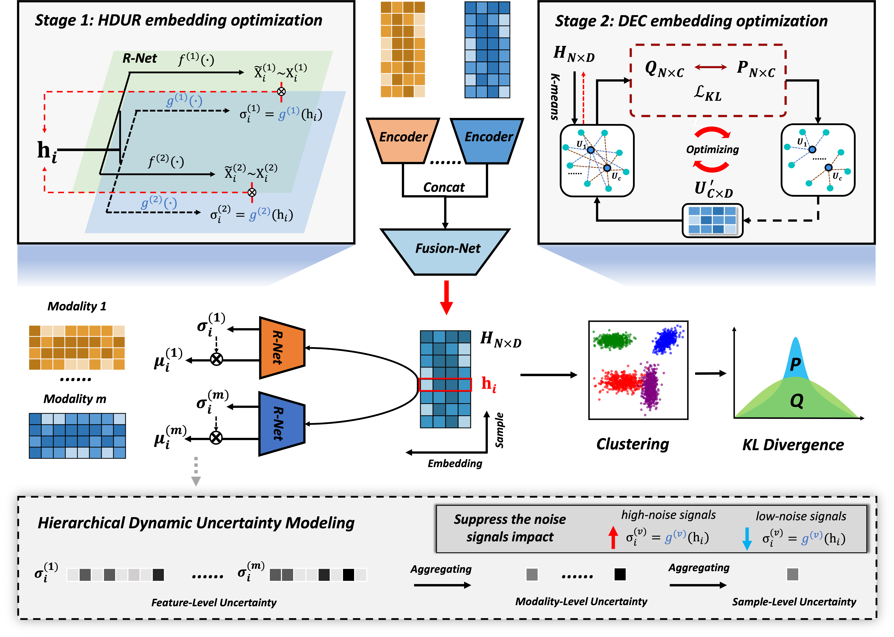
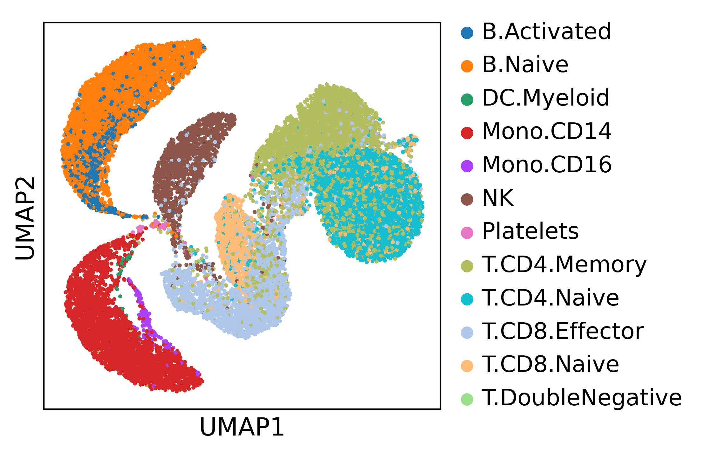
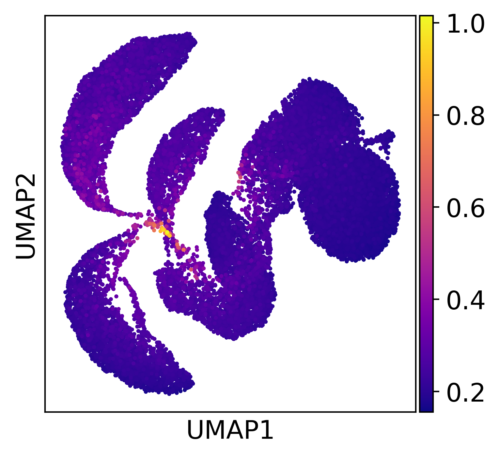
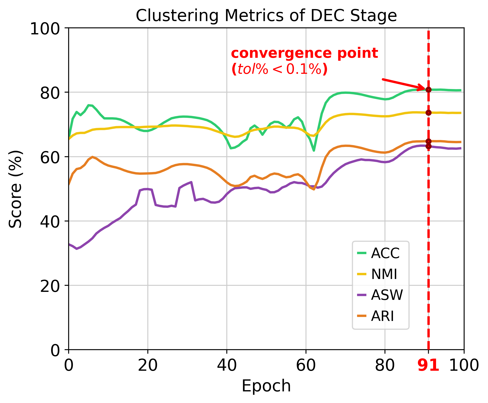

# HDUMEC
HDUMEC, a two-stage deep learning framework that learns robust and biologically meaningful multi-omics embeddings and performs clustering by combining **Hierarchical Dynamic Uncertainty Modeling** with **deep Embedded Clustering**. 

## Overview
Bulk and single-cell multi-omics data provide unprecedented opportunities to decode complex biological systems, yet their integration remains challenging due to high dimensionality, pervasive noise, and heterogeneous data quality.  Existing approaches typically overlook the dynamic data quality across features, modalities, and samples, relying instead on uniform weighting of all signals. We present **HDUMEC**, a two-stage deep learning framework that learns robust and biologically meaningful multi-omics embeddings and performs clustering by combining **Hierarchical Dynamic Uncertainty Modeling** with **deep Embedded Clustering**. In the first stage, we introduce hierarchical uncertainty modeling that quantifies dynamic uncertainty across features, modalities, and samples. This hierarchical design ensures interpretability and adaptively suppresses low-quality signals while enhancing reliable signals. Moreover, we further employ a deep embedded clustering strategy to jointly optimize latent representations and cluster assignments through a KL-divergence objective. Comprehensive evaluations on both bulk cancer multi-omics datasets from TCGA and single-cell multi-omics datasets from different sequencing technologies demonstrate that HDUMEC  outperforms state-of-the-art baselines in clustering performance, robustness to noise, and scalability. Furthermore, uncertainty estimates show strong correlations with data noise levels across different dimensions and highlight ambiguous cell or sample states, thereby providing interpretability. Together, these results suggest that HDUMEC is a promising tool for robust and interpretable multi-omics integration and clustering in both bulk and single-cell contexts. 



## 📦 Requirements
- scikit-learn  
- pytorch
- scanpy
- numpy
- pandas
- matplotlib
- scipy

## 🚀 Usage
To reproduce the results, simply run the following command:

```bash
python main.py # For TEA-seq Dataset
```

## 📊 Expected Results

After running the "main.py" script, a expected metric table of clustering performance will be shown like:

| Metric | Clustering ACC | NMI | ASW | ARI |
|--------|--------|--------|--------|--------|
| Score | 0.8079 | 0.7368 | 0.6324 | 0.6478 |

### Sample-level uncertainty Visualization
We can plot the UMAP of the samples by their labels and sample-level uncertainties, reference to the notebook [visual_sample_uncertainty.ipynb](./visual_sample_uncertainty.ipynb). We can observe that samples at the cell type boundaries exhibit higher uncertainty, indicating that the HDUR module can capture both the sample structure and the dynamical uncertainty at the sample level. Additionally, this provides additional interpretability, aiding in the understanding and identification of ambiguous or noisy samples.

<div align="center">
  
  
</div>

### Convergence Plot of the DEC Stage
We can plot the convergence of the stage 2, according to the output of the **main.py** script.
<div align="center">
  
</div>


## ⚠️ Disclaimer
This code is intended for **academic research only** and is **not approved for clinical use**. If you have any questions, please contact me via the following email [ljwstruggle@gmail.com](ljwstruggle@gmail.com).

## 📜 License
All rights reserved. Redistribution or commercial use is prohibited without prior written permission.
